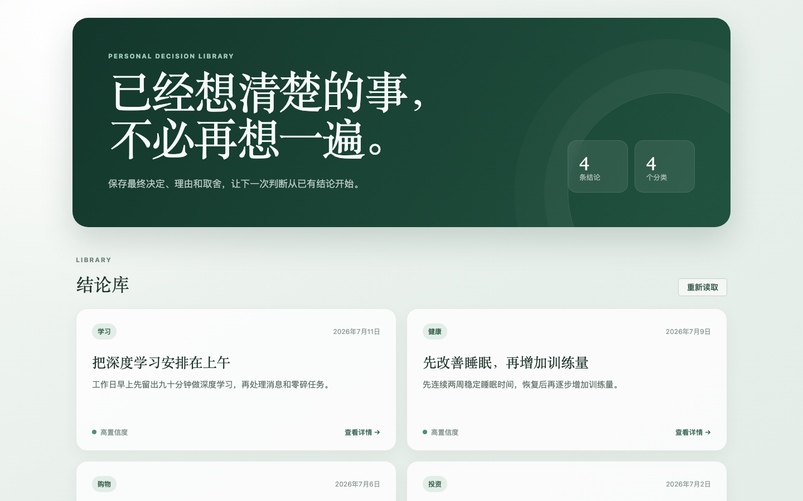
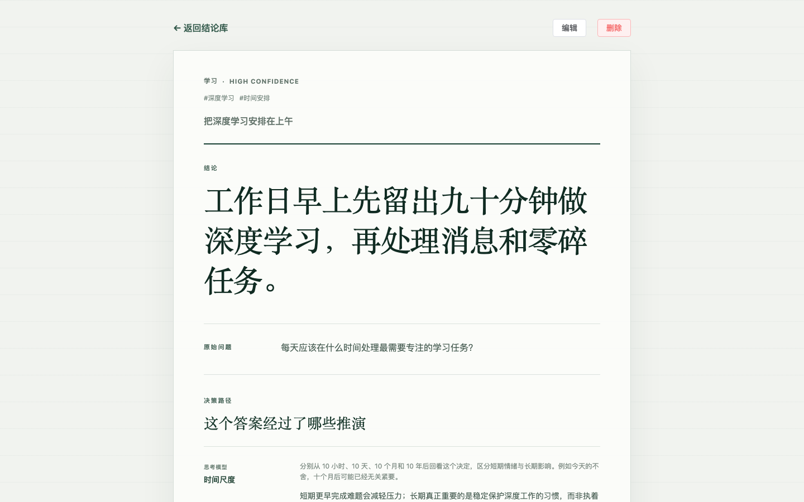
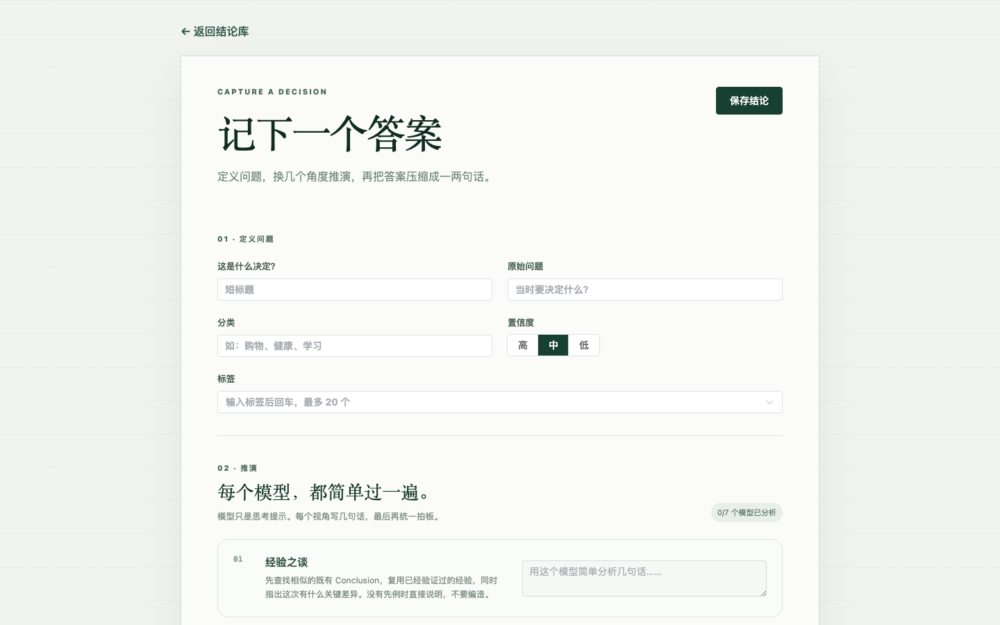
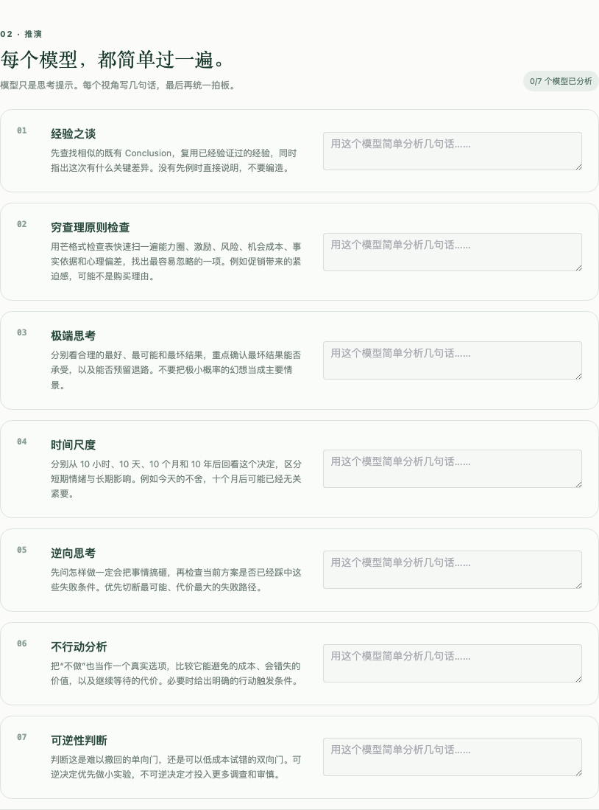
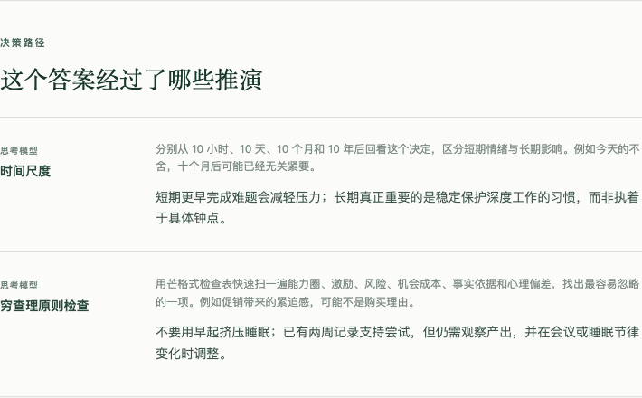

# Conclusion

Conclusion 是一个个人决策知识库，用来保存“已经想清楚的最终结论”。当自己或 AI 再次遇到相似问题时，可以直接复用已有决定、理由、取舍和适用条件，而不是从聊天记录中重新寻找或再次分析。

> 当前状态：后端已支持新增、列表、详情、关键词/分类/标签搜索、并发安全更新和删除；Vue 界面已支持结构化决策推演、列表、详情、新增、编辑和确认删除，依据区域支持 Markdown。网页搜索控件尚未实现。

## Screenshots

以下截图来自实际运行的 Vue 页面和固定的公开安全假数据，可通过仓库内的 Playwright 脚本重复生成。

### Conclusion 列表



### Conclusion 详情



### 新增 Conclusion



### 决策工作台



### 已保存的决策路径



截图生成方式和后续页面的命名约定见 [`screenshots/`](screenshots/README.md)。任何真实投资、健康或生活决策数据都不得出现在 README 截图中。

## MVP 功能

- 记录最终决定及其主要原因
- 在拍板前按需使用经验复盘、穷查理原则、极端/逆向、时间、不行动和可逆性模型
- 保留已经接受的缺点、放弃的方案和适用条件
- 新增、查看、编辑和删除 Conclusion
- 按标题、问题、结论和原因进行关键词搜索
- 按分类和标签筛选
- 标记 `High`、`Medium` 或 `Low` 置信度
- 后续通过 FengDock MCP 供 ChatGPT 查询、新增和更新 Conclusion

## MVP 页面

1. Conclusion 列表页
2. 新增 Conclusion
3. Conclusion 详情页
4. 编辑和删除
5. 关键词搜索、分类和标签筛选

## 数据结构

每条 Conclusion 包含：

| 字段 | 含义 |
| --- | --- |
| `id` | 稳定的唯一标识 |
| `title` | 标题 |
| `question` | 原始问题，普通文本 |
| `conclusion` | 最终结论，最多 280 字符的简短纯文本，建议 1–2 句 |
| `reason` | 主要原因，支持 GFM Markdown |
| `tradeoffs` | 接受的缺点或放弃的方案，支持 GFM Markdown |
| `conditions` | 结论适用和需要重新评估的条件，支持 GFM Markdown |
| `category` | 分类，如投资、健康、生活、学习 |
| `tags` | 标签集合 |
| `confidence` | `High`、`Medium` 或 `Low` |
| `decisionAnalysis` | 可选的结构化决策推演；每个模型保存一段简析 |
| `createdAt` | 创建时间 |
| `updatedAt` | 最后更新时间 |

SQLite 表结构、标签关系、搜索范围和删除语义见 [docs/data-model.md](docs/data-model.md)。

## 决策工作台

新增或编辑 Conclusion 时，依次使用七个模型，再写最终结论：

- 经验之谈：先找相似 Conclusion，再区分共同规律和本次差异
- 穷查理原则检查：从风险、独立判断、准备、谦逊、耐心等主题排查遗漏
- 极端思考：最好、最可能、最坏情况，以及保护措施
- 时间尺度：观察 `10 小时 / 10 天 / 10 个月 / 10 年`后的影响
- 逆向思考：先问怎样一定搞砸，再切断失败路径
- 不行动分析：比较保持现状避免的成本和错失的价值
- 可逆性判断：区分单向门与双向门，优先设计最小可逆试验

每个模型只有名称和几句话的解释，不再拆成多问题问卷；应用模型后只记录一段简析。用户让 AI “使用思考模型”时，MCP 会返回完整清单，AI 按顺序把全部模型各过一遍，再汇总最终结论。“经验之谈”会先检索已有 Conclusion；没有先例时明确说明，不编造经验。模型定义保存在后端注册表，网页与 MCP 读取同一份数据；通过 API/MCP 新增自定义模型后，无需修改前端即可出现。简析以 `modelId + modelVersion + answers.analysis` 保存。模型边界和扩展原则见 [docs/decision-models.md](docs/decision-models.md)。

## API

模块内部 API 使用 `/api` 前缀；接入 FengDock 后，对外统一位于 `/conclusion/api/...`。

```text
Available  GET    /api/health
Available  POST   /api/conclusions
Available  GET    /api/conclusions?query=&category=&tag=&limit=
Available  GET    /api/conclusions/{id}
Available  PATCH  /api/conclusions/{id}
Available  DELETE /api/conclusions/{id}
Available  POST   /api/decision-models
Available  GET    /api/decision-models
Available  GET    /api/decision-models/{id}
Planned    GET    /api/tags
```

`PATCH` 接受部分字段，但必须同时提交客户端最后读取到的 `expectedUpdatedAt`。如果记录已被网页、MCP 或其他写入者修改，接口返回 `409 Conflict` 和最新的 `currentUpdatedAt`，避免静默覆盖。

最终结论使用简短纯文本，保证在列表和详情中一眼读完。原因、取舍和适用条件保存 Markdown 原文；界面仅支持渲染 Markdown 中的公网 `https://` 图片 URL，Conclusion 不提供图片上传或本地图片托管。列表接口支持关键词、分类、标签和结果上限参数；关键词匹配标题、问题、结论和原因。具体请求/响应契约由测试固定。

## 架构

Conclusion 采用 FengDock 现有 `vendor/fire` 的 bundled-app 模式：

- 后端：Python 3.12、FastAPI、标准库 `sqlite3`
- 前端：Vue 3、TypeScript、Vite、Element Plus
- submodule：领域代码、SQLite 读写函数、CRUD API、前端和模块测试
- FengDock：根 Python 环境、单个 backend 容器、前端构建、进程启动、Caddy、数据卷、首页入口和统一 MCP
- 生产环境不为 Conclusion 创建独立容器、独立 venv、独立 MCP server 或独立部署流水线

接入后建议使用：

```text
Public path:       /conclusion
Internal port:     8006
Production data:   /app/vendor/conclusion/data/conclusion.sqlite3
```

详细职责和构建方式见 [docs/fengdock-integration.md](docs/fengdock-integration.md)。

## 数据与隐私

本地默认数据库：

```text
data/conclusion.sqlite3
```

可通过 `CONCLUSION_DATABASE_PATH` 覆盖数据库位置。应用启动时会创建父目录和初始 schema，并为 API/MCP 并发访问启用 WAL、foreign keys 和 5 秒 busy timeout。

SQLite 数据库、`.env`、备份、缓存和构建产物均不得提交 Git。README 截图和未来的公开演示只能使用明确构造的假数据。

## Quick Start

安装依赖并启动当前后端：

```bash
uv sync --frozen
uv run uvicorn app.main:app --reload --host 127.0.0.1 --port 8006
```

验证健康检查：

```bash
curl -fsS http://127.0.0.1:8006/api/health
```

预期响应：

```json
{"ok": true}
```

新增一条 Conclusion：

```bash
curl -fsS -X POST http://127.0.0.1:8006/api/conclusions \
  -H 'Content-Type: application/json' \
  -d '{
    "title": "是否现在更换书桌",
    "question": "现有书桌还能使用，是否应该立即升级？",
    "conclusion": "暂不更换，等现有书桌明显限制使用时再评估。",
    "reason": "当前改善有限，不值得立即占用预算和空间。",
    "tradeoffs": "暂时接受高度和收纳不够理想。",
    "conditions": "现有书桌影响坐姿或设备摆放时重新评估。",
    "category": "购物",
    "tags": ["家具", "延迟购买"],
    "confidence": "Medium"
  }'
```

## 后续 MCP

MCP 由 FengDock 的统一 OAuth 服务对外提供。读取工具：

- `list_conclusions`
- `search_conclusions`
- `get_conclusion`

写入工具：

- `create_conclusion`
- `update_conclusion`
- `create_decision_model`

决策模型读取工具：

- `list_decision_models`
- `get_decision_model`

每个思考模型只定义 `name` 和简短的 `explanation` 两个业务字段。用户要求使用思考模型时，AI 应按 `list_decision_models` 的固定顺序把全部模型各过一遍，每个模型只做几句话的具体分析，再汇总为最终结论。

Conclusion 的 `app/db.py` 提供可复用读写函数，FengDock 像加载 `vendor/fire/app/db.py` 一样加载它们。读取工具使用只读连接；写入工具使用普通事务连接，并通过 MCP annotations 明确标记副作用。MVP 暂不开放 `delete_conclusion`，删除仍在 UI 中由用户确认。

模型更新暂不原地覆盖：历史 Conclusion 已引用具体 `modelVersion`，后续应以“创建新版本”实现 `update_decision_model`。完整工具契约和 AI 使用流程见 [docs/mcp-contract.md](docs/mcp-contract.md)。

## 暂时不做

- 向量数据库
- 自动 AI 总结
- 复杂关联图
- 富文本编辑器
- 复杂权限系统
- 过度设计 UI

## Development

运行当前测试：

```bash
uv run python -m pytest
```

- [COOKBOOK.md](COOKBOOK.md)：本地开发、测试、截图、提交、FengDock 接入、部署、验证和回滚
- [docs/roadmap.md](docs/roadmap.md)：MVP 小步功能顺序
- [docs/fengdock-integration.md](docs/fengdock-integration.md)：父子仓库职责和生产接入方式
